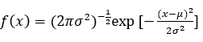

# Sensor segmentation in activity recognition with noise, imbalanced data and concept drift

In recent years, data stream segmentation has become a very important topic in machine learning science, as more and more data can be treated as data streams. Most of this data is characterized as high speed, non-stationary data distribution and unlimited length, examples of which can be seen in activity detection, credit card transactions and telecommunications. Concept drift occurs when the distribution of data streams changes over time. Concept drift requires the adjustment of classifiers to adapt to new conditions. The type of changes can be classified as abrupt, gradual, incremental and recurring concept drift. Real-world applications are always a combination of different types of concept drifts. In this thesis, by using 4 commonly used methods in the chunk-based classification of data streams (ACDWM, DWMIL, DUE and KUE), a relationship is made in order to compare the robustness of the algorithms with each other against noise and also considering the imbalance ratio and concept drift is presented. The mentioned algorithms were examined and tested with 4 datasets. By examining the graphs obtained from entering different amounts of noise, imbalance ratio and concept drift to the data, an efficient relationship has been obtained.

Data segmentation is an essential process for activity recognition when using machine learning techniques. Previous studies on physical activity detection have mostly relied on the sliding window approach for segmentation. However, choosing a fixed window size for multiple activities with different durations may affect the recognition accuracy, especially when the activities belong to only one moving or stationary category.

A robust algorithm means that the algorithm finds a solution and does not stop due to creating noise in the data; The output for all inputs should be close to the real answer and not have many changes. The robust algorithm tolerates input and calculation errors and converges to the correct solution. Each segment of datastream is classified, then the algorithms are compared in terms of robustness.

Human activity detection uses different data formats such as images and sensor signals with the aim of learning and identifying different types of human activities. Human activity detection has been widely used in some real-world applications, such as environment-assisted living systems and home monitoring, because it helps to detect unexpected activities, such as sudden falls or dangerous situations.

With the increase of elderly population and progress in smart environments, human activity detection has become a popular research field. The development of sensors and communication technology enables the realization of smart homes. By installing different types of devices in a smart home, the activities of residents can be monitored and identified by many machine learning methods.

Human activity detection has attracted a lot of attention because it can be used in continuous monitoring of human behavior in smart homes, smart monitoring systems, advanced manufacturing, health care, rehabilitation, abnormal behavior detection, gaming, personal fitness, etc. Human activity recognition frameworks have provided ways to use the obtained data, which are monitored by different sensors, body movements, ambulatory and postural activities, and user actions. These methods mainly include the use of video-based sensors, wearable sensors, smartphone sensors and wireless sensors. Human activity detection can generally be classified into two categories: sensor-based and video-based activity detection.

## The vision-based approach

The vision-based approach is information-rich, but often hampered by ethical and privacy concerns, especially in the healthcare program when dealing with patients. In contrast, the devices used in the sensor-based approach, including wearable sensors, can work with limited power and cost and have no limitations in terms of the surrounding environment or the place where the activities must be performed. As a result, activity detection systems usually adopt a sensor-based approach.

## The sensor-based approaches

Several studies have been conducted to investigate the effect of different sensor positions on detection accuracy. These studies show that the position of the sensor should be determined mainly based on the type of activity being studied. Forms of movement, including walking, running, as well as non-motor activities, such as standing and sitting, can be detected with an accuracy of 83% to 95% by placing the sensor on the parts of the lower limb (thigh and ankle). To increase the accuracy of detection of upper limb activities, sensors are placed on the wrist and arm.

Most of the human activity detection research involves the collection of generated data that stores data through smart phones and wearable sensors due to its ubiquity, easy installation, and ease of use. Sensors are widely embedded in smart devices such as mobile phones, watches, etc. They can continuously record information about human movement.

## Objectives

Research purposes

1. Investigating the robustness of algorithms that use segmentation in activity detection.
2. Examining the three factors of noise, concept drift and imbalance rate in datastream algorithms used for segmentation.
3. Presenting the proposed formula for robustness and effect of noise, concept drift and rate of imbalance in segmentation, which compares algorithms.
4. Several tests are performed to introduce Gaussian noise to the algorithms and check the criterion of the area under the curve (AUC).

## Datasets

1. Skoda

This dataset includes 10 movements performed in car maintenance scenarios. 20 sensors are placed in the left and right arm of the person. It also includes 3D acceleration features for each sensor. Each movement is repeated about 70 times.
31 activity classes have been selected in this dataset. All activity classes include the movement of the user's hand(s) or arm(s) captured using a distributed set of 5 inertial sensors. These modules are integrated into the person's cover and are aligned with the upper body. In the original article, only a subset of six activity classes, including opening the engine hood, closing the engine door, opening the trunk, checking the hinges of the trunk, closing the trunk, and checking the fuel tank cap, were selected for analysis.
2. WISDM

WISDM is collected using accelerometers embedded in phones. A phone is placed in the front pockets of each person's pants. Six regular activities of walking, running, climbing stairs, descending stairs, sitting and standing are considered.
To collect data for supervised learning, a large number of users were required to carry an Android-based smartphone while performing some daily activities. Then, 29 volunteers were asked to help carry a smartphone while performing a series of activities. The subjects carried an Android phone in the front pocket of their pants and were asked to walk, jog, climb stairs, descend stairs, sit, and stand for specific periods of time.

Data collection was controlled by an app on the mobile phone. The program, through a simple GUI, allows user registration, starts and stops data collection, and identifies activities performed by tagging. This program allows the type of data collected from sensors such as global positioning system and accelerometer to be controlled and the number of times it is collected. In all cases, accelerometer data is collected every 50 ms; So there are 20 samples per second. Data collection is monitored by a WISDM team member to ensure data quality.

In this study, six activities of walking, running, climbing stairs, descending stairs, sitting and standing are considered. These activities have been chosen due to their regular implementation by a large number of people in their daily routine. These activities include movements that often occur for significant periods of time, so they are easier to identify. In addition, most of these activities include repetitive movements that make them easier to recognize. The acceleration data of each of these activities is recorded in three axes. The Tz axis records the movement of the front leg and the y axis records the up and down movement. The x-axis records the horizontal movement of the user's foot. Figure shows these axes for a user.


3. HCI

HCI focuses on the changes caused by the displacement of sensors. The movements include arm or hand movements that describe the different shapes of an upward triangle, an inverted triangle, and a circle. Eight sensors are attached to the right lower arm of each person. Each movement is recorded for more than 50 repetitions and each repetition lasts for 5 to 8 seconds.
In this data set, the acceleration of the left leg is recorded for six different normal aerobic movements as shown in figure below.


The fitness scenario includes 6 classes of kicks, knee lifts, jumping jacks, superman jumps, kneeling and running backwards. For each class, the body movements are shown in two rows. To create this data set, 10 bluetooth acceleration sensors are placed on the person's foot as shown in figure below, 5 sensors are in the leg and 5 sensors are in the thigh.


In the HCI scenario (left), eight sensors are attached to the right arm, including six sensors on the forearm and two sensors on the upper arm. In the fitness scenario (right), 10 sensors are attached to the person's left leg, including five on the thigh and five on the lower leg.
For the data of each sensor, the acceleration magnitude was calculated and the mean and variance characteristics were extracted based on an eight-second sliding window with two-thirds overlap. The resulting two-dimensional feature space for each sensor position is shown in figure below. A smaller difference in the feature space is observed between sensors that are directly adjacent to each other. Sensors that are further apart have more differences in the feature space.

Also, there is less similarity between the position of sensors 5 and 6, even if they are adjacent, because they are located in different parts of the same organ. For places 4, 5 and 7-10, we can see very strong overlaps between the "flips" and "movement above two knees" classes. There are also very strong overlaps between the "jumping jacks" and "superman jumps" classes for all sensor positions.


4. PS
PS data was collected with four smartphones in four body positions. Smartphones were equipped with accelerometer, magnetometer and gyroscope. Four participants were asked to perform six activities of walking, running, sitting, standing, walking up and down stairs for several minutes.

First, the program was launched on all four smartphones, and then they were placed in four body positions of a participant. After completing the activity, they were removed from the participant's body and the program was stopped. This action caused noise (abnormal spikes) at the beginning and end of each activity. These noisy parts were removed before data analysis.

Then, the collected data were divided into small segments for feature extraction using the sliding window approach. It is important to choose a suitable window size and you can set different values ​​for it. A sliding window of 2 seconds is chosen because a window size of 2 seconds is considered to be an effective and sufficient value for reasonable activity detection performance.

Each sensor reports values ​​along three dimensions, including x-axis, y-axis and z-axis. For example, accelerometers measure acceleration in meters per second squared (m⁄s^2), magnetometers measure magnetic fields in micro-tesla (Tµ), and gyroscopes measure rotation rates in radians per second (rad⁄s) along the axes. Each orientation axis of a smartphone affects the performance (accuracy) of classification algorithms because the value of sensors such as accelerometer changes according to the orientation of the smartphone. Most of the existing works assume a fixed orientation while evaluating different classification algorithms. For this reason, the fourth dimension is added to the existing three dimensions of each sensor, which is called sensor size. Unlike the other three axes of the accelerometer and gyroscope, the magnitude of the sensor is not sensitive to orientation. The magnitude of the sensor for each sensor is calculated using the following relationship:

```bash
Magnitude= √(x^2+ y^2+ z^2 )
```

There are four dimensions including x, y, z and magnitude for each sensor. For each sliding window with 50% overlap, two time domain features, mean and standard deviation, were extracted for the four dimensions of each sensor; Therefore, in total, 4 x 2 = 8 features were calculated for each sensor and 3 x 8 = 24 features were calculated for all sensors.

## Noise

In machine learning, noise is a type of complexity in data. Data sets resulting from real measurements often contain noise data. The causes of noise can be different, but usually it is due to defects, faulty calibration of measuring equipment or human error. Noise in the data may reduce the performance of a machine learning model in terms of classification accuracy.

Noises are divided into two categories: feature noise and class noise. Feature noise is the error introduced into the imputed values, which are called missing features, "don't know" or wrong values. Class noise can be inconsistent labeling of samples. Examples appear more than once, but with a distinct classification. Wrong classification may be done (incorrect output) and samples are labeled with wrong classes.

## Robustness against noise

Supervised machine learning classifiers are often benchmarked by their accuracy for specific tasks; But another important and sometimes neglected feature of the classifier is its robustness against noise. Since real-world data often contains noise, in such cases a classifier should be able to withstand noise to some extent. Measuring the ability of a classifier to withstand noise can be done by training it on a noise-free dataset and then on a noisy copy of the same dataset. The results can be measured by criteria such as the accuracy criterion or the average area under (AUC) the curve in all segments.

When creating noise datasets, things like the place and manner of introduction and type of noise should be considered. Regarding the type of noise, classification characteristics and continuous characteristics should be considered. Gaussian noise is used for existing features and noise values ​​are added based on Gaussian distribution. Noise is applied to the data according to the following probability density function:



## Data sets used in experiments

In the tests performed to define relationships, 4 data sets related to activity detection were used. The synthetic datasets used are generated with the concept drift generator. These data sets include different types of real drift and virtual drift. The previous concept drift is entered into the data stream by manually adjusting the imbalance rate in all datasets with low sampling in order to approach the definition of common concept drift. The imbalance rate in experiments varies as follows:

1. Sudden drift: The imbalance rate is initially set at 0.01. After half of the datastream, the imbalance rate suddenly changes to 0.99, that is, the majority class becomes the minority class with an imbalance rate of 0.01. Preliminaries are reset in a sudden thrust situation.

2. Gradual drift: the imbalance rate is initially set at 0.01. After one-third of the datastream, the imbalance rate starts to increase gradually until it reaches 0.99 in two-thirds of the data flow. Preliminaries are reset at the start and end positions of the gradual drift.


The imbalance rate here refers to the percentage of samples in the positive class. To control the imbalance rate, downsampling is performed on 1000 samples in the original data stream. If the initial imbalance rate in this segment is smaller than the assigned imbalance rate, the majority class is less sampled, and if the assigned imbalance rate is smaller than the initial imbalance rate in this segment, the minority class is less sampled. Since the imbalance rate is different in each data set, the concept drift position after downsampling is also different.

The datasets used are as follows:


1. Skoda mini checkpoint dataset

this dataset contains 10 movements performed in the car maintenance scenario. It has 20 3D acceleration sensors (60 features) and there are segmented and continuous samples in the dataset.
2. HCI gestures dataset

This data set is obtained by performing 5 free or guided hand movements in front of the blackboard. It has 8 3D acceleration sensors (24 features) and there are segmented and continuous samples in the dataset.
3. HCI Tabletop Gestures dataset

To collect this data set, 9 writing movements using the palm alphabet in 3 sizes and on several touch surfaces have been examined, using the mouse while sitting and standing, using A standing tablet includes the use of a sitting and standing touch table.
4. WISDM data set

In collecting this data set, the raw data of the accelerometer and gyroscope sensor are collected from smart phones and smart watches at a rate of 20 Hz. This dataset was collected from 51 subjects. They do 18 activities for 3 minutes. Sensor data is stored in a different directory for each device (phone or watch) and each sensor type (accelerometer or gyroscope); So there are 4 data lists. There are 51 files related to 51 exam topics in each directory. The format of each entry is the same. In addition to the raw timeseries sensor data, examples are also produced that describe the sensor data using a window of 10 seconds.
5. Opportunity dataset

This dataset is used to detect human activity with wearable, object and environmental sensors. This dataset has been created as a benchmark for human activity detection algorithms, such as automatic data classification and segmentation and consists of 6 runs per user from 4 users. Of these runs, 5 are daily life activities, and the sixth run is a practice run in which users perform a sequence of activities. Wearable sensors include 7 inertial measurement units, 12 3D acceleration sensors, 4 3D localization sensors. Object sensors collect data from 12 objects with 3D acceleration and 2D rotation speed. Environmental sensors include 13 switch sensors and 8 3D acceleration sensors.

## Segmentation

Segmentation in the science of machine learning is a type of unsupervised learning that segments data into several parts without the need for labels and based on some measured criteria. In this particular issue, the task of data segmentation is to identify variable longitudinal segments of multivariate data streams that are likely to contain information related to activities. A sliding window is a common approach for segmenting data streams related to activity detection. The size of a sliding window is chosen empirically based on hardware limitations. In the segmentation of continuous stream data for activity detection, a sliding window is usually moved over the static and dynamic data. Then, the difference between two adjacent windows is calculated with the threshold value to find the breaking point.

Advantages

* Segmentation of the datastream causes operations to be performed on small segments of data, so the increase in speed is noticeable in this method.

* Segmentation causes the operation to be focused on a small segment and finally the final result is announced by using the results of all the segments. So the proposed method increases the accuracy.

Disadvantages

* If the imbalance rate in the data is very high, segmentation will cause imbalanced data to be placed in each segment and this will reduce the accuracy.

* The use of segmentation methods requires valuing some initial parameters that have an impact on the final result. If it is not possible to choose suitable values ​​for these parameters, the final results will have a sharp drop. Setting these parameters is one of the challenges of the proposed method.

## Algorithms

In this project, four new methods are used in the classification based on the segment of the data stream to detect the activity. These four methods are DUE, KUE, DWMIL and ACDWM.

1. Kappa Updated Ensemble (KUE) Algorithm

In this algorithm, a new ensemble method named Kappa Updated Ensemble has been implemented. Learning from datastreams in the presence of concept drift is one of the biggest challenges of machine learning. Algorithms designed for such scenarios must consider the potentially unlimited size of data along with its constantly changing nature and the need for real-time processing. Group approaches of classifiers have gained significant popularity in datastream studies due to their high predictability and effective mechanism in reducing concept drift. The KUE algorithm is a combination of segment-based and line-based ensemble approaches that uses the kappa statistic for dynamic weighting and selection of base classifiers. New classifications have been updated using new samples and Poisson distribution to achieve more diversity.

Each base classifier in KUE can participate in voting and increase the robustness of KUE. An extensive experimental study shows that KUE can perform better than other advanced algorithms on standard and unbalanced concept drift data streams despite its low computational complexity.
2. DUE Algorithm

This algorithm is used to learn unbalanced data streams with concept drift. The important point in this algorithm is that it is also suitable for imbalanced data. Only a few specific algorithms address the common issue of concept drift and imbalance due to its complexity. Meanwhile, the existing segmentation algorithms for classification of unbalanced non-stationary data streams always need to store previous data, which consumes a lot of memory. To overcome these issues, the DUE algorithm is introduced. Compared to existing techniques, this algorithm has five advantages:

* It learns one segment of data at a time without needing to access previous data.
* In the method of updating the model, it emphasizes on the samples that are incorrectly classified.
* It can react in time to different types of concept thrusts.
* It can adapt to the new conditions by changing the majority class to the minority class.
* It keeps a limited number of classifiers to ensure high performance.

Experiments on artificial and real datasets show the effectiveness of DUE in learning unbalanced non-stationary data streams.
3. DWMIL Algorithm

In this algorithm, a segment-based incremental learning method called Dynamic Weighted Majority is proposed on data streams with concept drift and class imbalance problem. The drift of the concept that occurs in the flow of data endangers the accuracy and stability of the online learning process. If the datastream is imbalanced, it will be challenging to detect and treat concept drift. A group framework with dynamic weighting of basic classifications is used according to their performance in the current segment. 

Compared to existing methods, this algorithm has four features:

* It can remain stable for datastreams without concept drift and quickly adapt to new concept drift.
* It is completely incremental, that is, no previous data is saved.
* It keeps a limited number of classifiers to ensure high performance.
* It is simple and requires only one threshold parameter.

Experiments on synthetic and real datasets with concept drift show that this algorithm performs better than advanced algorithms with lower computational cost.
4. ACDWM Algorithm

In this algorithm, an incremental learning method is proposed which is based on Dynamic Weighted Majority to deal with imbalanced datastreams with concept drift. If the datastream is imbalanced, it is hard to detect concept drift. Ensemble algorithms are effective for classifying datastreams with concept drift, a classifier is built for each segment of input data and its corresponding weight is adjusted to manage concept drift. However, it is difficult to adjust the weights to achieve a balance between the stability and compatibility of the classifiers in the ensemble algorithm.

In addition, when the datastream is imbalanced, using a fixed size segment to build a classifier can cause more problems. A segment of data may contain very few examples of the minority class or even no examples of the minority class and only examples of the majority class. The classification built on such a segment is unstable. An ensemble framework with dynamic weighting of classifiers based on their classification performance on the current data segment is used. The segment size is dynamically selected by statistical hypothesis tests to achieve the stability of the classifier on the current segment. Compared to existing methods, this algorithm has three advantages as follows:

* It can maintain its stability while processing datastreams without concept drift and quickly adapt to the new concept drift.
* It is fully incremental, meaning it does not need to store previous data and stores a limited number of classifiers to ensure high performance.
* It dynamically selects the size of the segment in the concept drift environment.

Experiments on synthetic and real datasets containing concept drift show that ACDWM outperforms both segment-based and on-line methods.

## Installation and run

ACDWM code is run in python and the other  3 algorithms are written and run with matlab.

## Results

### Calculation of robustness

To define the robustness relationship, we need to define two parameters, the segment size and the imbalance rate:

1. Segment size

Due to the fact that ensemble methods of classifiers need to be divided into several segments, the value of this variable can be very effective in the final output, because in the end, a voting operation must be done to reach a conclusion. Select the final output. 

For example, if the segment size value is 10, the number of end segments is equal to 10 and the voting operation must be performed between 10 outputs. Any of these outputs (0 or 1) that collects more votes is chosen as the final output. The value of this variable should be chosen approximately. For example, if the value of this variable is considered very low (2-5), the obtained output cannot be relied upon and will be poorly suited; Because the number of obtained classifications is small. As a result, voting is done between a small number of outputs and the result obtained from the declaration of opinion will be based upon a small number of classifications. If the value of this variable is considered too high, the execution time of the program will be very high and it is practically not usable in the real world with a low execution speed. At the same time, there is also the possibility of overfitting phenomenon. Classifiers may get too close to the training data and lose their flexibility to predict new data.
2. Imbalance rate

Imbalance rate in classification methods determines the impact of imbalanced data. It is very difficult and time-consuming to create segmentation on imbalanced data. The higher this value is, the more the effect of imbalanced data will be, and the segmentation will be more imbalanced.
To define the desired relationship, 4 algorithms were evaluated on 4 datasets with different sizes of segments. The graphs in this chapter are the result of the average results for all parts. The evaluated parameter is the area under the curve (AUC).

The robustness of an algorithm can be attributed to the following reasons:

1) Incremental algorithms

This concept shows that the algorithm does not need any previous data for prediction, which saves storage. Considering that the previous data can have unpredictable effects on the current results, then not using them can affect the robustness of the algorithm. Of course, this influence is not permanent. If the amount of previous data involved in the prediction is very small or the previous data is very similar to the current data, non-increment can affect the robustness of the algorithm.
2) Number of classifications

The number of classifications involved in the voting method can influence the robustness of the algorithm. Adding the number of classifications can generally shift the results and make many changes in the voting results. So, this factor can be considered as an influential factor in the robustness of the algorithm. It should be noted that changes in the number of classifications can greatly affect the robustness of algorithms. Small changes will not have much impact in this area.
3) Segment size

This parameter can change the number of classifications, because a classification is created on each Segment in the group method. According to the previous explanations, the number of classifications has an effect on the robustness of the algorithm. As a result, by increasing or decreasing this variable too much, the robustness of the algorithm changes (This causes a difference in the results of DWMIL and ACDWM).
4) Weighted majority

Weighted voting means that some clauses will have a higher percentage of votes in the final output. A clause can have several votes instead of one vote. It is clear that this factor changes the robustness of the algorithm, because the segment with a higher vote degree can have more power in selecting the final output.
5) Dynamic weighting
In this method, a weighted model is used to build each classifier. In this way, each data set selected for each classification is determined based on the weight of the samples. For example, if in the first classification set, the fifth sample did not have the correct output, this sample will have a double weight and will be repeated more in the next round of execution. The amount of weight added in each iteration is different and this can affect the robustness of the algorithm.

### Calculation of noise, imbalance rate and concept drift

In order to find a relationship in order to compare the robustness of the classification algorithms based on the segment of datastream against noise, experiments were conducted in different conditions.

To calculate the robustness relationship, the results of 3 different scenarios have been used. For testing at this stage, 3 different measures of noise, concept drift and imbalance rate were used. These 3 scenarios are as follows:

1) Concept drift and imbalance rate are equal to zero and noise is variable.
2) Concept drift is equal to zero and the noise values ​​and imbalance rate are variable.
3) The imbalance rate is equal to zero, and the concept drift and noise values ​​are variable.

For each mentioned scenario, 4 algorithms have been tested on 4 datasets. In the following, the diagrams related to the algorithms are displayed on the activity detection datasets in the first scenario.

 
 

In the following, the diagrams related to the algorithms are seen on the activity detection datasets in the second scenario.

 
 

In the following, the diagrams related to the algorithms on the activity detection datasets in the third scenario can be seen.

 
 

### Steps of the proposed solution

1. Applying Gaussian noise to algorithms
First, Gaussian noise is applied to the algorithms. The percentage of noise is 0, 5, 10, 15, 20, 40, 60 and 80 respectively.

2. Obtaining diagrams and calculating the measure of the area under the curve (AUC)
The graphs of 4 algorithms in the 3 mentioned scenarios are obtained separately for activity detection datasets. These charts show the average area under the curve for all segments.

3. Calculation of standard deviation
The standard deviation is calculated by placing the average of the area under the curve for all parts in the noise-free state instead of the average in the equation below. Due to the large changes of the results shown in the diagrams, the standard deviation is chosen for comparison. This criterion is calculated for each algorithm and for all data sets.


4. Calculating the standard deviation of the algorithm
The standard deviation of the algorithm is calculated by using the numbers of step 3. This criterion shows the robustness of the algorithm on activity detection datasets. This criterion is calculated for all algorithms. In this step, μ in the standard deviation relation is the same as the average of the results in step 3.
5. Comparison and conclusion

### Evaluation results

In this section, the results of the evaluation of 4 algorithms on 4 datasets using different noise percentages are displayed. It should be noted that the reported results are obtained from taking the average of 10 independent executions to maintain the stability of the results. Also, the results are obtained by taking the average of all the tested segments. The criterion to be evaluated is the area under the curve.

In the KUE algorithm, the combination of segments with kappa weight rate is used. When designing a learning system, we have many choices such as display mode, learning parameters and training data. This variety causes a kind of variance in the system performance. As a result, if there are different systems and their results are used, it is possible that the error distribution will be focused around the target and by increasing the sampling from this distribution, we will get a better result. When the number of samples increases, the possibility of increasing the error in the output by adding noise to the data is very high. As a result, the final output can be seen in some diagrams. To get a suitable result, the classifiers used in ensemble methods of classifiers must have the following conditions:

1) Each one alone is acceptably accurate. Of course, there is no need to be completely accurate.
2) Each one act as a complement to the other. In the sense that they should not all be the same and produce the same result.

With increasing noise, the first mentioned condition is violated. As a result, the final output will drop sharply.
The size of the segment is selected by trial and error. The desired algorithm should be tested and validated with different values ​​of the segment size in order to choose the best value. The segment size is dynamically selected by statistical hypothesis tests so that the classification is stable enough on the current data segment. One of the reasons for the extreme fluctuation of the ACDWM algorithm can be this case. Also, noise in the data can affect the output fluctuation. Increasing noise causes data destruction and eliminates the possibility of proper output.

Considering that the introduced noise may improve or destroy the results, the resulting fluctuation of the output will be very high. The standard deviation of the algorithm is used to check the robustness.

The results have shown that in the case where the noise is zero, there are no noticeable changes in the final results by changing the imbalance rate. In order to check the robustness and its effect on the imbalance rate, this experiment was performed with different percentages of noise.

An algorithm that has a lower standard deviation is known as a more robust algorithm.

In these experiments, different amounts of noise, imbalance rate and concept drift were used to evaluate the effectiveness of the algorithms from these 3 criteria. As a result, the reasons for the robustness of the algorithms were explained by adding different percentages of noise to them and checking the changes in the criterion of the area under the curve based on the diagrams. The numbers in the diagrams below are calculated to 2 decimal points.

1. First scenario

The first scenario is the main work presented in this thesis. As a result, ACDWM and DWMIL algorithms are stronger than DUE and KUE. The standard deviation of ACDWM and DWMIL algorithms is lower than DUE and KUE on activity detection datasets in the first scenario. So, ACDWM and DWMIL are more robust than the other two algorithms. In addition, the ACDWM algorithm is more robust than the DWMIL algorithm with a lower standard deviation than DWMIL on activity detection datasets.


2. The second scenario

ACDWM has better robustness on activity detection datasets based on the standard deviation of the algorithm.


3. The third scenario
ACDWM and DWMIL algorithms have lower algorithm standard deviation than DUE and KUE for activity detection datasets in the third scenario. So the strength of ACDWM and DWMIL is higher than the other two algorithms. Also, ACDWM performs better than DWMIL with a lower algorithm standard deviation for activity detection datasets.


## Lessons Learned

Data imbalance is a common problem in the field of datastream. In such cases, the data can be imbalanced or may evolve over time. In addition, data imbalance along with concept drift creates new and unique challenges. Class roles may change and the majority group becomes the minority or the minority class becomes the majority. Several classes may be different from before, new classes may appear, old classes may disappear, or sample level problems may emerge. In these cases, monitoring each class for changes in its characteristics is not enough, because the classifier must track the rate of entry of new samples in each class.

Classical imbalance is a practical problem and usually occurs when there are fewer samples in the target class (positive or minority class) compared to other classes (negative or majority class).

Class imbalance can be caused by the nature of a program, limitations in collecting a representative dataset, and as a result of cost or privacy issues. Class imbalance creates several challenges in learning tasks, including skewed class distributions, insufficient data, and more complex concepts.

Since these challenges interfere with concept drift in the field of datastream, the problem becomes even more severe and complex. For example, during a datastream, the time interval to receive a positive sample can be unpredictably long. Therefore, it is always difficult to collect enough positive samples in a timestamp to unbiasedly infer the true performance of the descriptor for this class. Furthermore, consecutive positive samples may be drawn from distinct arbitrary distributions; Therefore, the distribution difference can exist between both positive samples that were not received at the same time. Algorithms designed for the classification of imbalanced data streams must consider the challenges caused by imbalance, while being equipped with effective mechanisms to manage concept drift.

In this research, by using 4 widely used algorithms (DUE, KUE, DWMIL and ACDWM) in the classification based on the datastream segment, a relationship was proposed to compare the robustness of the algorithms. The experiments show that the imbalance rate for each segment is a constant value. If the imbalance rate is higher, the size of each classification group will be larger to ensure that each sample of the majority class is involved in the training process with a certain probability.

The imbalance rate in classification methods determines the impact of imbalanced data. It is very difficult and time-consuming to create segmentation on imbalanced data. The higher this value is, the more the effect of imbalanced data will be and the segmentation will be more imbalanced. As a result, after applying the same segment size and imbalance rate in all algorithms, the value of the area under the curve in the DWMIL algorithm is almost lower than the ACDWM algorithm.

## Citation

1. **[Dynamic Segmentation for Physical Activity Recognition Using a Single Wearable Sensor](https://www.mdpi.com/2076-3417/11/6/2633)** paper by Nora Alhammad and Hmood Al-Dossari .

2. **[Hybrid fuzzy c-means CPD-based segmentation for improving sensor-based multiresident activity recognition](https://ieeexplore.ieee.org/document/9324819)** paper from D. Chen, et al.

## License

This project is under [GPL-3.0 license](https://choosealicense.com/licenses/gpl-3.0/):

## Feedback

If you have any feedback, please reach out to me at *<aliamani019@gmail.com>*.

## Authors

[@AliAmani](https://github.com/MrAliAmani)
